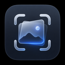

<div align="center">
  

  # SwiftSnap

  **A polished, native macOS screenshot utility built for fast captures, clean previews, and clipboard-first workflows.**

  
  
  
  
  

  <br />

  <sub>Designed for creators, builders, and anyone who takes screenshots all day.</sub>
</div>

---

## ✨ What is SwiftSnap?

SwiftSnap is a lightweight menu bar screenshot app for macOS that focuses on speed, clarity, and native platform feel. It gives you a compact capture toolbar, multiple capture modes, instant clipboard copying, optional file saving, and a refined thumbnail preview after every shot.

The app is intentionally simple: open it from the menu bar or keyboard shortcut, capture what matters, then keep working. SwiftSnap avoids turning screenshots into a complicated workflow while still offering thoughtful controls for naming, saving, previewing, and managing recent captures.

---

## 🌟 Highlights

| Feature | Description |
| --- | --- |
| ⚡ **Fast global capture** | Start capturing from anywhere with the built-in `⌘⇧S` shortcut. |
| 🖼️ **Three capture modes** | Capture a selected area, a single window, or the full screen. |
| 📋 **Clipboard-first workflow** | Every capture is copied to the clipboard immediately so it is ready to paste. |
| 💾 **Optional file saving** | Save captures automatically when you want a persistent screenshot library. |
| 🧾 **PNG and JPG export** | Choose the output format that best fits your workflow. |
| 🏷️ **Custom filenames** | Use filename templates with `{date}` and `{time}` tokens. |
| 🪟 **Native preview thumbnail** | Review, rename, save, or delete your latest capture from a small floating preview. |
| 🕘 **Recent captures** | Keep quick access to your most recent screenshots from the menu bar. |
| 🔐 **Permission-aware onboarding** | Guided setup for Screen Recording and Accessibility permissions. |
| 🎨 **Beautiful macOS design** | Uses SwiftUI, AppKit windows, subtle animation, glass effects, and system iconography. |

---

## 🧭 Product Experience

SwiftSnap is built around a short, repeatable flow:

1. **Trigger** capture from the menu bar or `⌘⇧S`.
2. **Choose** Area, Window, or Full Screen from the floating toolbar.
3. **Capture** using the native macOS interaction model.
4. **Paste immediately** from the clipboard, or let SwiftSnap save the file automatically.
5. **Review** the thumbnail preview for quick actions such as rename, save as, or delete.

This keeps the core interaction close to macOS while adding the speed and polish expected from a dedicated screenshot tool.

---

## 🧩 Capture Modes

### Area Capture
Select exactly the region you need. This is ideal for sharing a UI detail, a crop of a design, or a small part of a document.

### Window Capture
Capture a focused application window without manually cropping around its edges.

### Full-Screen Capture
Capture the current display when you need the full context of your workspace.

---

## 🛠️ Tech Stack

| Layer | Technology | Role |
| --- | --- | --- |
| Language | **Swift 5** | Core application logic and native macOS integration. |
| UI | **SwiftUI** | Settings, onboarding, preview surfaces, and composable app views. |
| macOS integration | **AppKit** | Menu bar app behavior, floating panels, pasteboard, sounds, and window management. |
| Capture foundation | **ScreenCaptureKit** + macOS `screencapture` | Permission-aware screen capture flow and native screenshot interactions. |
| Shortcuts | **Carbon Hot Keys** | Global keyboard shortcut registration. |
| Persistence | **UserDefaults** + security-scoped bookmarks | Preferences and durable access to the selected save folder. |
| Testing | **XCTest** | Unit coverage for settings, filenames, saving, clipboard behavior, recents, and capture state. |

---

## 🏗️ App Design

SwiftSnap uses a small service-oriented architecture so the product stays easy to reason about:

```text
SwiftSnapApp
├── MenuBarController        # Menu bar status item and app-level actions
├── CaptureService           # Capture state machine, overlays, previews, and result handling
├── ShortcutService          # Global keyboard shortcut registration
├── ClipboardService         # Pasteboard image writing and clipboard checks
├── SaveService              # File export, rename, delete, and save-as operations
├── SettingsStore            # User preferences and save-folder bookmark persistence
├── PermissionService        # Screen Recording and Accessibility permission checks
└── RecentCapturesManager    # In-memory recent capture list and metadata updates
```

### Design principles

- **Native first:** SwiftSnap leans on macOS conventions instead of reinventing capture interactions.
- **Small surfaces:** The toolbar, onboarding, settings, and preview all stay focused on one job.
- **Fast by default:** Captures are copied to the clipboard immediately, with saving as an optional layer.
- **User-controlled storage:** Screenshots can be clipboard-only or written to a chosen folder using security-scoped access.
- **Polished feedback:** Sound, thumbnail previews, menu bar recents, and notifications make capture success obvious.

---

## 🔐 Privacy & Permissions

SwiftSnap needs macOS permissions only for the features it provides:

- **Screen Recording** allows the app to capture screen content.
- **Accessibility** supports global shortcut behavior and richer window capture interactions.

Captures are processed locally on the Mac. SwiftSnap does not include analytics, network upload logic, or cloud syncing code.

---

## ⚙️ Preferences

SwiftSnap includes settings for:

- Save location
- Clipboard-only mode
- PNG or JPG output
- Filename format templates
- Launch at startup
- Capture sound
- Completion notifications

The default filename pattern is:

```text
SwiftSnap {date} at {time}
```

Example output:

```text
SwiftSnap 2026-05-31 at 14.30.05.png
```

---

## 🧪 Quality

The project includes XCTest coverage for the app's core behavior:

- Settings persistence
- Filename generation
- Clipboard writes
- Save, rename, and delete operations
- Recent capture updates
- Capture state transitions and capture modes

---

## 🗺️ Project Structure

```text
SwiftSnap/
├── Models/                  # Capture modes, image formats, and capture result metadata
├── Services/                # App logic for capture, saving, clipboard, shortcuts, settings, and permissions
├── Views/
│   ├── Capture/             # Toolbar, overlay, thumbnail, toast, and highlight views
│   ├── Onboarding/          # First-run permission and product setup
│   └── Settings/            # Preferences UI
├── Assets.xcassets/         # App icon and menu bar artwork
└── SwiftSnapApp.swift       # App entry point and dependency wiring

SwiftSnapTests/              # XCTest test suite
SwiftSnap.xcodeproj/         # Xcode project
```

---

## 💜 Why SwiftSnap?

SwiftSnap is for people who want screenshots to feel invisible: quick to start, obvious to finish, and ready to paste the moment they are captured. The app combines a minimal menu bar footprint with a refined native interface so it feels like part of macOS rather than another bulky productivity tool.

---

## 📄 License

SwiftSnap is released under the [MIT License](LICENSE.txt).
